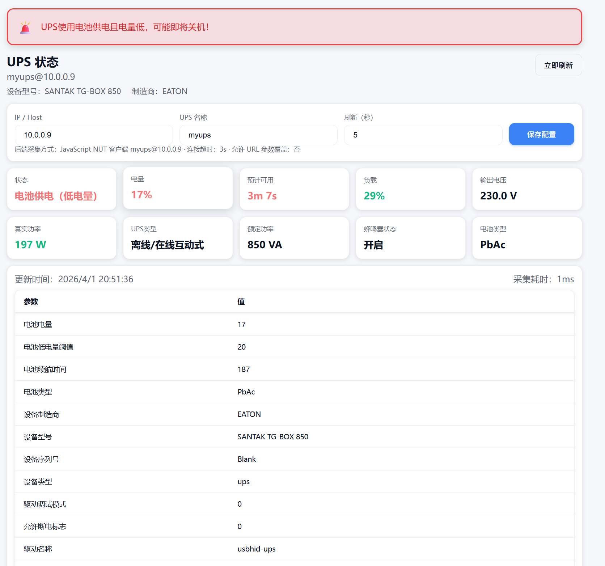
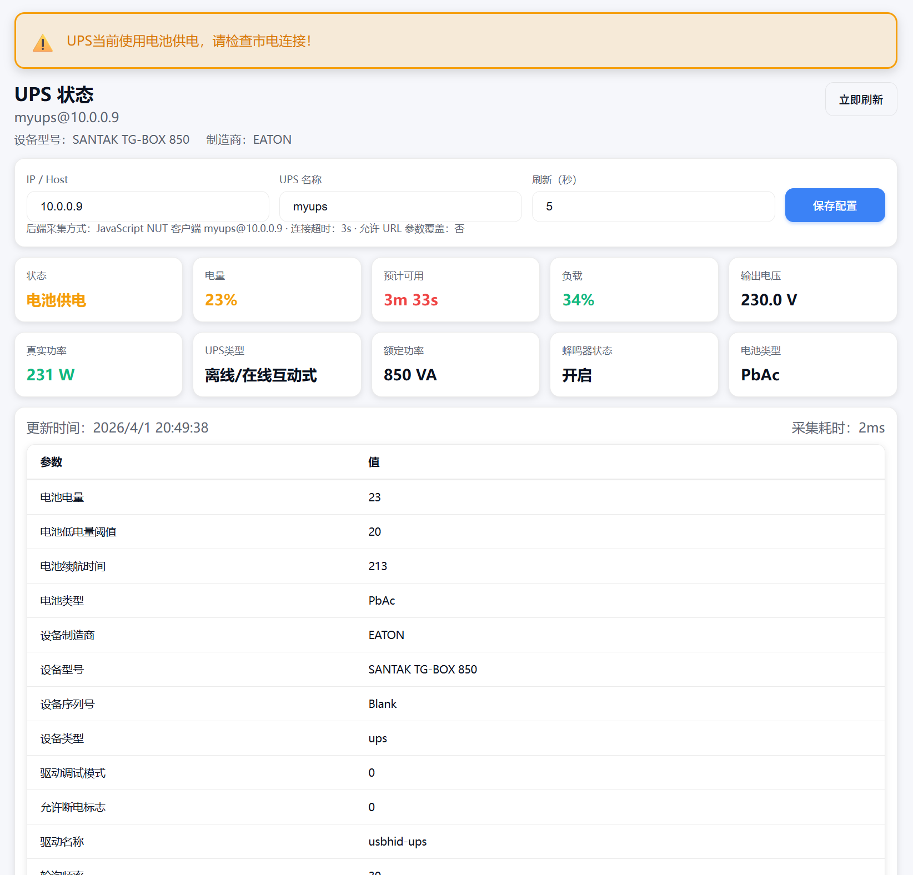
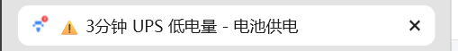

# UPS Web（轻量级 UPS 状态展示页）

一个基于 Node.js 的轻量级网页应用，用于实时监控和展示 UPS（不间断电源）的状态信息。该项目使用纯 JavaScript 实现了 NUT（Network UPS Tools）客户端，无需安装 NUT 或 upsc 命令即可运行。

## 功能特性

- 📊 **实时监控**：显示 UPS 的状态、电量、负载、电压等关键参数
- 🔄 **定时刷新**：支持自定义刷新间隔，实时更新 UPS 状态
- ⚙️ **配置管理**：在网页中直接修改 UPS 服务器 IP、UPS 名称等配置
- 📱 **响应式设计**：适配不同屏幕尺寸，在手机和电脑上都能正常显示
- 🌙 **深色模式**：支持系统深色模式，提供更好的视觉体验
- 🔧 **API 接口**：提供 RESTful API，方便与其他系统集成
- 🔍 **参数覆盖**：支持通过 URL 查询参数临时覆盖配置（需启用）

## 技术实现

- **前端**：原生 HTML、CSS、JavaScript
- **后端**：Node.js 内置 http 模块
- **NUT 客户端**：纯 JavaScript 实现，通过 TCP 直接与 NUT 服务器通信
- **数据存储**：本地 JSON 文件存储配置

## 快速开始

### 方法一：直接运行

1. **安装依赖**

```bash
# 克隆项目后，在项目目录执行
npm install
```

2. **启动服务**

```bash
npm start
```

默认监听地址：
- `http://0.0.0.0:8765/`

### 方法二：使用 Docker

1. **构建镜像**

```bash
docker build -t ups-web .
```

2. **运行容器**

```bash
docker run -d --name ups-web -p 8765:8765 ups-web
```

或者使用环境变量自定义配置：

```bash
docker run -d --name ups-web \
  -p 8765:8765 \
  -e HOST=0.0.0.0 \
  -e PORT=8765 \
  ups-web
```

### 环境变量

可通过环境变量修改服务配置：

- `HOST`：监听地址（默认 `0.0.0.0`）
- `PORT`：监听端口（默认 `8765`）

## 配置说明

启动后打开网页，在配置区域填写以下信息：

- **IP / Host**：NUT 服务器的 IP 地址或主机名（例如 `10.0.0.9`）
- **UPS 名称**：UPS 的名称（例如 `myups`）
- **刷新（秒）**：数据刷新间隔，建议设置为 5-60 秒

点击“保存配置”后，配置会被写入 `config.json` 文件并立即生效。

### 配置文件详解

`config.json` 文件包含以下配置项：

| 配置项 | 类型 | 默认值 | 说明 |
|--------|------|--------|------|
| `ups` | string | "myups" | UPS 名称 |
| `ip` | string | "127.0.0.1" | NUT 服务器 IP 地址 |
| `refreshSeconds` | number | 5 | 数据刷新间隔（秒） |
| `commandTimeoutSeconds` | number | 3 | 连接超时时间（秒） |
| `allowQueryOverride` | boolean | false | 是否允许通过 URL 查询参数覆盖配置 |

## 界面介绍

### 顶部区域
- **标题**：显示应用名称
- **设备信息**：显示 UPS 设备型号和制造商
- **立即刷新**：手动触发数据刷新

### 配置区域
- 输入框：用于修改 UPS 服务器 IP、UPS 名称和刷新间隔
- 保存按钮：保存配置并立即生效

### 指标卡片区域
- **状态**：UPS 当前状态（在线/电池供电等）
- **电量**：电池剩余电量百分比
- **续航**：电池预计续航时间
- **负载**：UPS 当前负载百分比
- **输出电压**：UPS 输出电压
- **真实功率**：UPS 当前输出功率
- **UPS类型**：UPS 的类型（在线式/离线式等）
- **额定功率**：UPS 的额定功率
- **蜂鸣器状态**：蜂鸣器的开关状态
- **电池类型**：UPS 使用的电池类型

### 状态展示效果

#### 电池供电且低电量状态


#### 低电量状态


#### 电池供电且低电量状态（标题栏）


### 详细参数表格
- 显示从 NUT 服务器获取的所有参数
- 支持参数名称中文显示
- 表格行悬停效果，提高可读性

## API 接口

### `GET /api/ups`
- **功能**：获取 UPS 状态数据
- **响应**：JSON 格式，包含 UPS 状态、电量、负载等信息
- **示例**：`GET http://localhost:8765/api/ups`

### `GET /api/config`
- **功能**：获取当前配置
- **响应**：JSON 格式，包含当前的配置信息
- **示例**：`GET http://localhost:8765/api/config`

### `POST /api/config`
- **功能**：更新配置
- **请求体**：JSON 格式，包含要更新的配置项
- **示例**：
  ```json
  {
    "ip": "10.0.0.9",
    "ups": "myups",
    "refreshSeconds": 10
  }
  ```

## 故障排除

### 常见问题

1. **连接超时**：检查 NUT 服务器 IP 是否正确，确保服务器运行正常
2. **无法获取数据**：检查 UPS 名称是否正确，确保 NUT 服务器已配置该 UPS
3. **页面显示异常**：尝试清空浏览器缓存，或使用最新版本的浏览器

### 日志查看

服务启动后，可在终端查看运行日志，了解详细的连接和数据获取情况。

## 许可证

MIT License
